# Nightmode-extension
This is a Night mode theme that can be activated and deactivated by using a toolbar button at the top right of a QVF application.
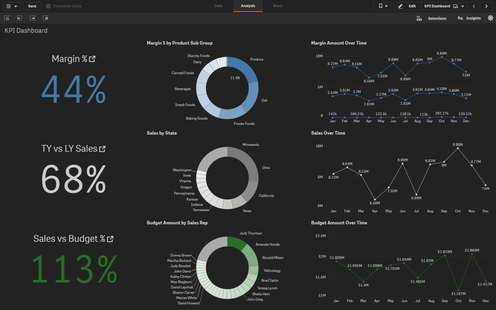
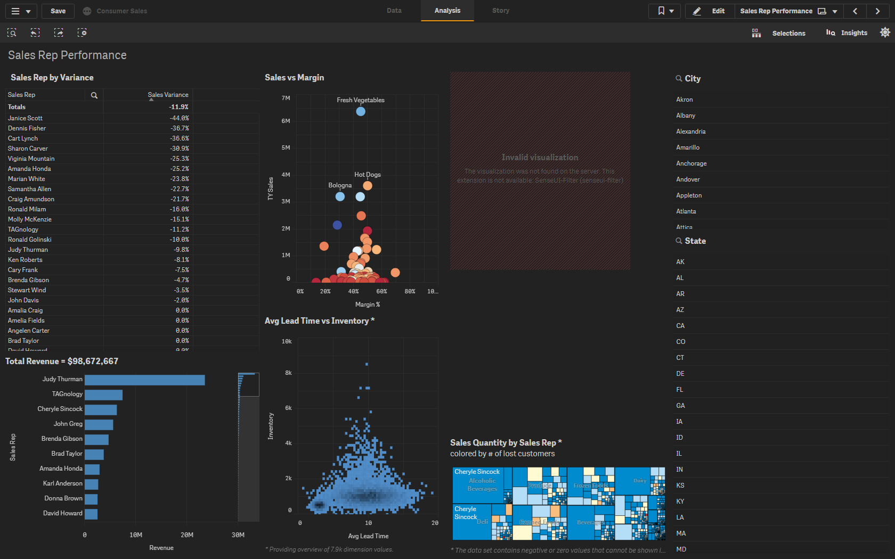
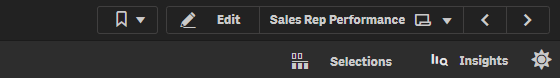
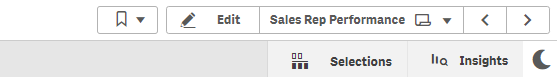

#### Menu:

#### Search Bar:
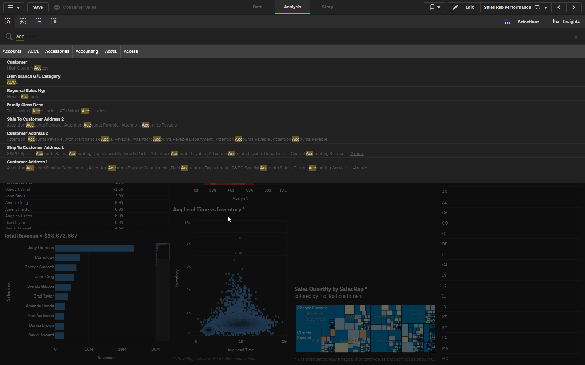

## Instalation:
* Download the project [here](https://github.com/clusterdesign/nightmode-extension)
* Unzip the file
* Paste the two extracted folders  (nightmode and ClusterNightMode) into your Qlik Sense Extensions folder
* Open Qlik Sense and the qvf that you want to apply the theme to
* On the first sheet of your qvf, click on the Edit button 
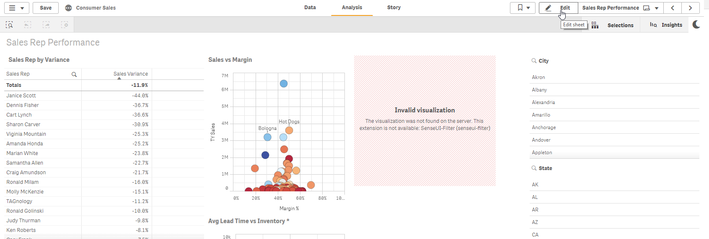
* Go to Custom Objects => Extensions and drag the Cluster Night Mode extension to the place you want to display it your sheet
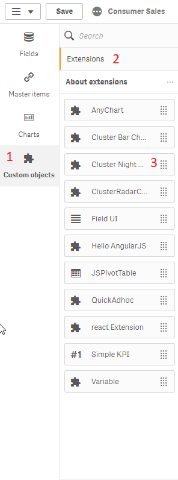
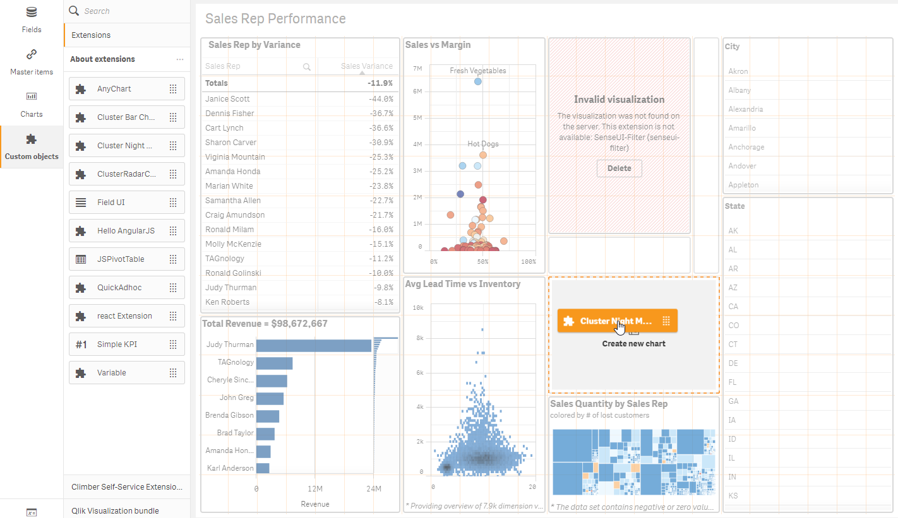
-Done! now you just need to click on the Save and Done buttons, and the night mode button will appear on the toolbar right hand side
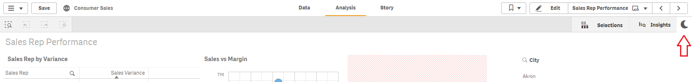

## It also works for smaller screens
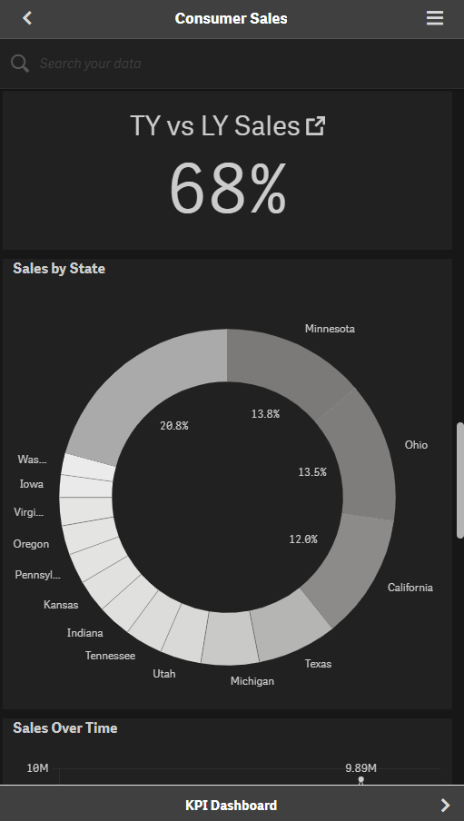
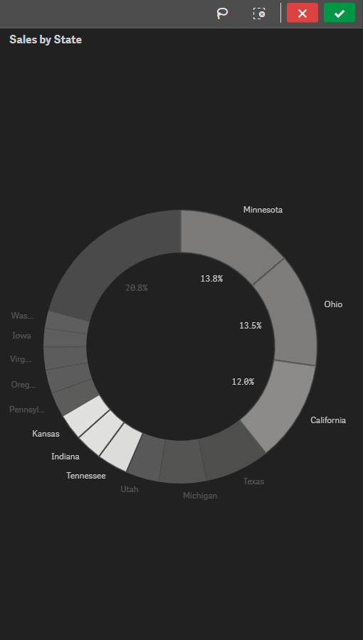
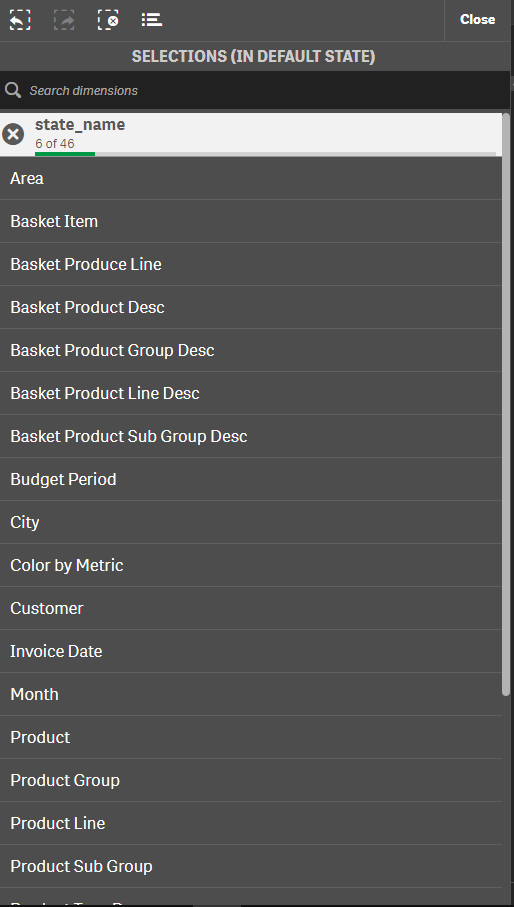
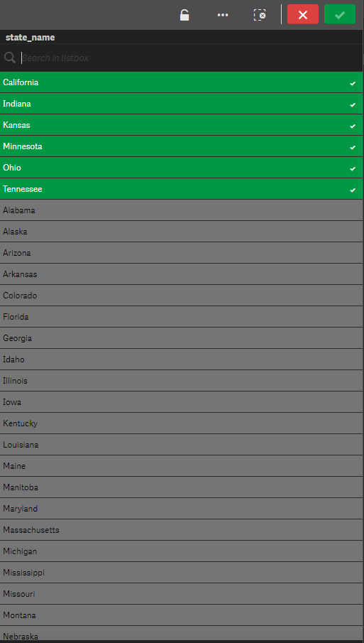
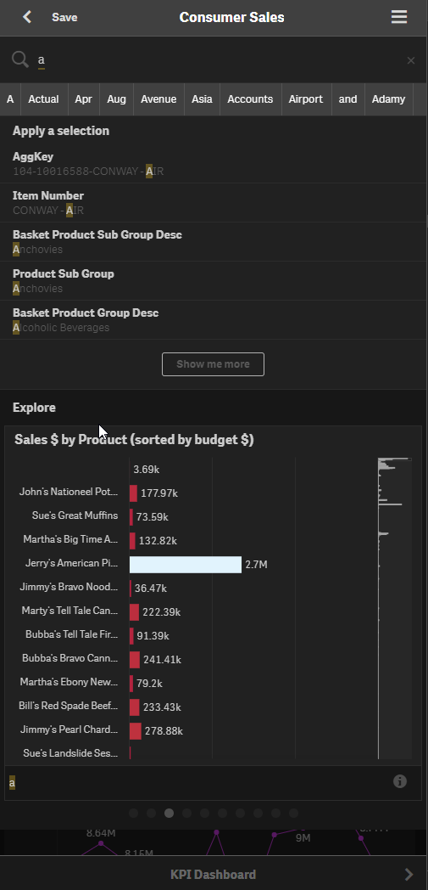
